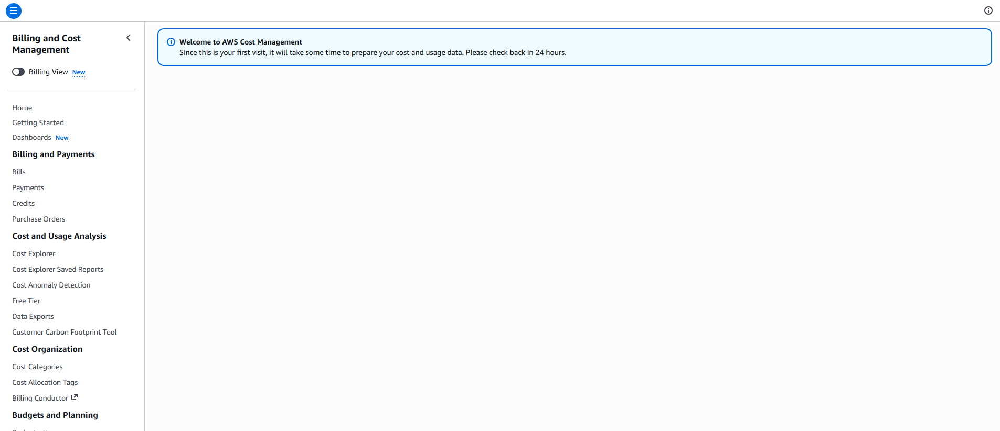
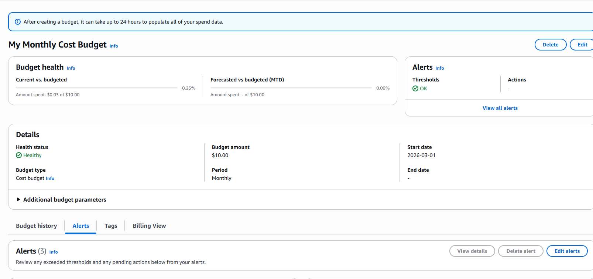
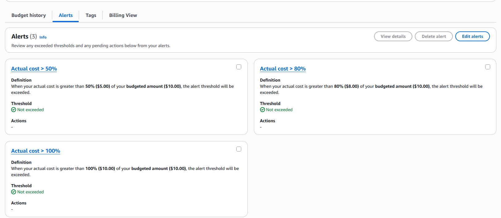
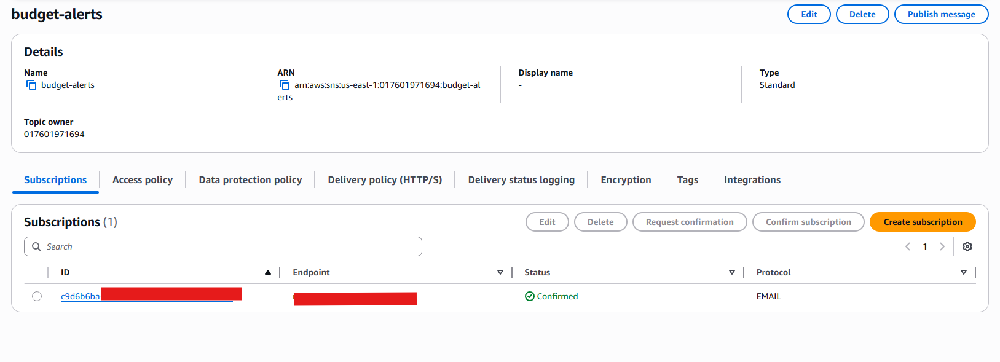
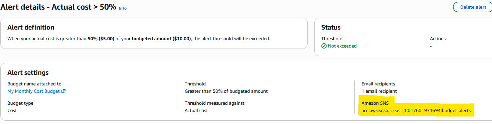

# AWS Cost Monitoring & Alerting System

## Overview

This project implements a cloud cost monitoring and alerting system in AWS to track usage, prevent overspending, and improve cost visibility.
---

## ❗ Problem

Cloud costs can quickly grow without proper monitoring and alerts. Without visibility it becomes difficult to identify which resources are generating costs and when spending exceeds expectations.

---

## 💡 Solution

This project uses AWS Cost Explorer, AWS Budgets, and SNS notifications to:

* Monitor cloud spending
* Set budget thresholds
* Trigger alerts when limits are exceeded

---

## Architecture

* **EC2** → generates usage/cost
* **AWS Budgets** → defines spending limits
* **SNS** → sends alert notifications
* **Cost Explorer** → analyzes cost data
---

## Implementation Steps

### 1. Enable Cost Explorer

* Activated AWS Cost Explorer via Billing Dashboard
* Note: Data takes up to 24 hours to populate


---

### 2. Create Budget

* Monthly budget: **$10**
* Alerts configured:

  * 50% (Actual)
  * 80% (Actual)
  * 100% (Forecasted)



---

### 3. Configure SNS Alerts

* Created SNS topic: `budget-alerts`
* Subscribed email endpoint for notifications
* Confirmed email subscription


---

### 4. Connect Budget to SNS

* Linked SNS topic ARN to all budget alerts
* Enabled automated notifications via SNS



---

### 5. Deploy Cost-Generating Resource

* Launched EC2 instance:

  * Name: `cost-monitor`
  * Type: `t3.micro`


## Key Concepts Demonstrated

* Cost monitoring and budgeting (FinOps fundamentals)
* AWS resource tagging strategy
* Event-driven alerting using SNS
* Cloud cost visibility and analysis

---

## Challenges & Learnings

* Cost Explorer data is delayed (~24 hours)
* SNS email subscriptions require manual confirmation
* Cost Explorer cannot be provisioned via Terraform
* Budget thresholds must be tuned to avoid alert fatigue

---

## Future Improvements

* Integrate with **Grafana dashboards**
* Automate cost control actions using **AWS Lambda**

---

## Terraform

This project includes a Terraform configuration to automate SNS and budget setup. Users must still enable Cost Explorer manually and have active AWS resources generating usage.
---

## 📁  roject Structure

```
cost-monitoring/
│
├── README.md
├── terraform/
├── screenshots/
```

---

## 📊 Outcome

This project demonstrates how to design a cost-aware cloud environment with proactive alerting and resource-level visibility, aligning with real-world cloud engineering and FinOps practices.
